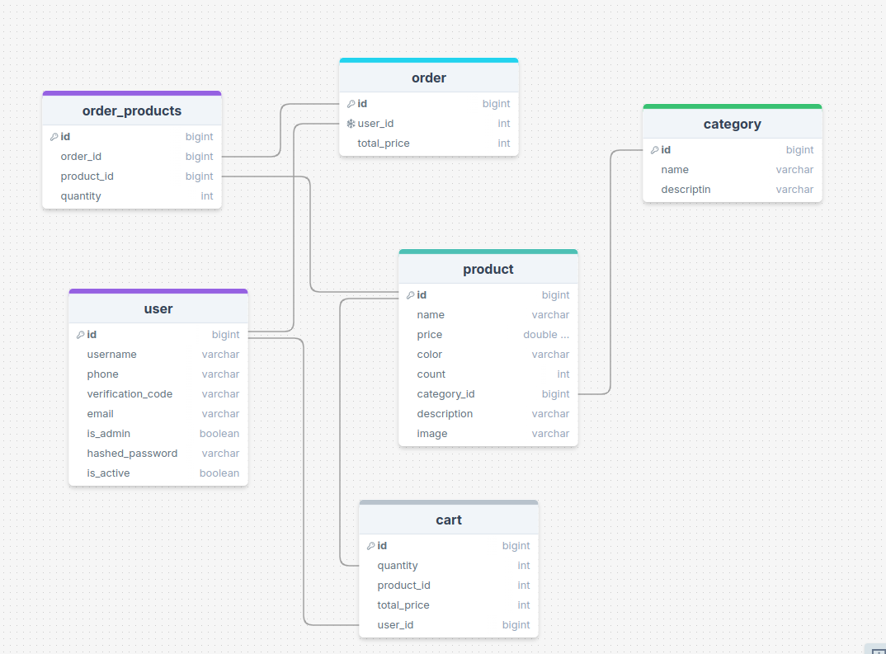

# Описание проекта
## Это REST API для управления пользователями, товарами, корзиной и заказами для сети кофеен на вынос. Приложение реализовано на FastAPI и использует PostgreSQL, JWT для аутентификации, SMTP для отправки уведомлений и Docker для контейнеризации. API документировано через встроенный Swagger. Приложение работает автономно, без фронтенда.

## Структура проекта
FastAPI — основной фреймворк для разработки.
PostgreSQL — реляционная база данных.
JWT (JSON Web Token) — для аутентификации пользователей.
SMTP — для отправки уведомлений о заказах.
Docker — для контейнеризации приложения.
Swagger — для документации API.
Основные возможности


Управление пользователями:

Регистрация, аутентификация и авторизация.
Работа с JSON Web Tokens (JWT).
Очистка не верифицированных пользователей через два дня.
Управление заказами:

CRUD операции для создания, удаления, изменения и получения информации о заказах.
Управление меню:

CRUD операции для управления товарами и категориями товаров.
Управление корзиной:

Добавление товаров в корзину, удаление товаров и оформление заказов.
Чат поддержки:

Реализация чата на технологии WebSocket для общения с пользователями.

## Фильтрация данных:
    Пагинация

## Статичная информация:

Маршрут для получения информации о расположении, графике работы и т.д.


    
## Swagger:

Документация API через Swagger UI.

## Postman Collection:

FastApi_coffe_shop_POSTMAN_collection.json


## Docker:

Контейнеризация приложения для удобства развертывания.
Пример маршрутов
- 1. Управление пользователями
    - POST /registration — Регистрация пользователя
    - POST /authentication — Аутентификация пользователя
    - POST /verification — Подтверждение личности пользователя
    - POST /me — Получение информации о текущем пользователе
    - GET /users — Получение всех пользователей
    - GET /user/:id — Получение одного пользователя
    - PUT /user/:id — Изменение данных пользователя
    - PATCH /user/:id — Редактирование данных пользователя
    - DELETE /user/:id — Удаление пользователя
- 2. Управление категориями
    - POST /category — Создание новой категории
    - GET /categories — Получение всех категорий
    - GET /category/:id — Получение одной категории
    - PUT /category/:id — Изменение категории
    - PATCH /category/:id — Редактирование категории
    - DELETE /category/:id — Удаление категории
- 3. Управление товарами
    - POST /product — Создание нового товара
    - GET /products — Получение всех товаров
    - GET /product/:id — Получение одного товара
    - PUT /product/:id — Изменение товара
    - PATCH /product/:id — Редактирование товара
    - DELETE /product/:id — Удаление товара
- 4. Управление заказами
    - POST /order — Создание нового заказа
    - GET /orders — Получение всех заказов
    - GET /order/:id — Получение одного заказа
    - PUT /order/:id — Изменение заказа
    - PATCH /order/:id — Редактирование заказа
    - DELETE /order/:id — Удаление заказа
- 5. Работа с JWT
    - POST /access — Получение токена
    - POST /refresh — Обновление токена
- 6. Управление корзиной
    - POST /cart — Добавление товаров в корзину
    - DELETE /cart/:id — Удаление товара из корзины
    - DELETE /cart/ — Очистка корзины


## Как запустить приложение
## Клонировать репозиторий:
``` bash
git clone git@github.com:ibroxim91/fast_api_cofee.git
```

## Запуск с помощью Docker: Для контейнеризации приложения используйте Docker. Убедитесь, что у вас установлен Docker и Docker Compose.

Запустите контейнер:

```bash

docker-compose up --build
```
Это создаст и запустит приложение с PostgreSQL и FastAPI.


## Доступ к Swagger UI: После запуска приложение будет доступно по адресу:

http://localhost:8080/docs


## Структура базы данных

